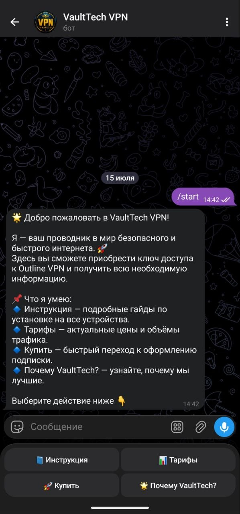
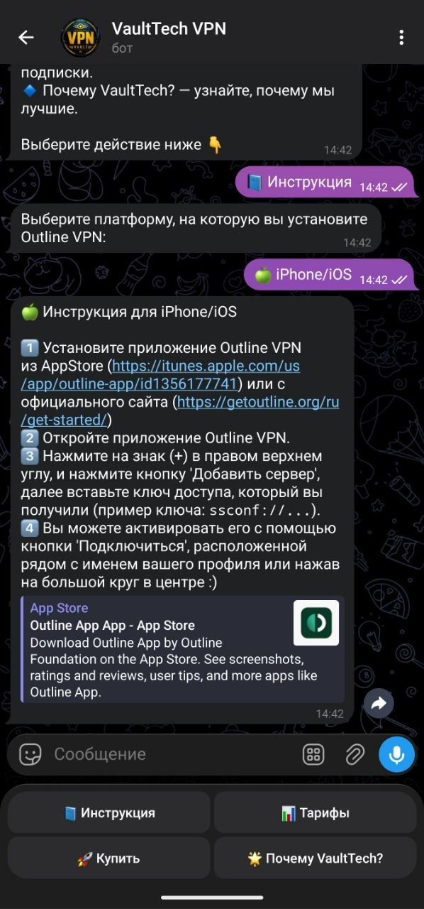
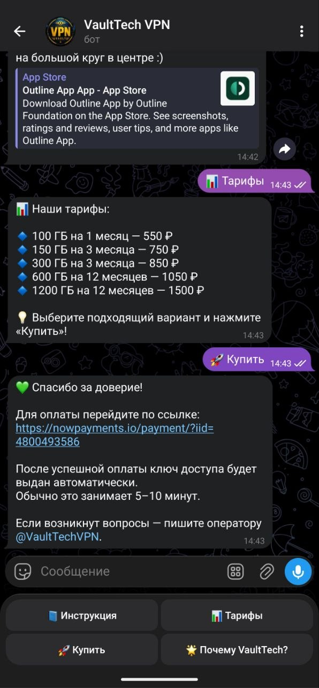
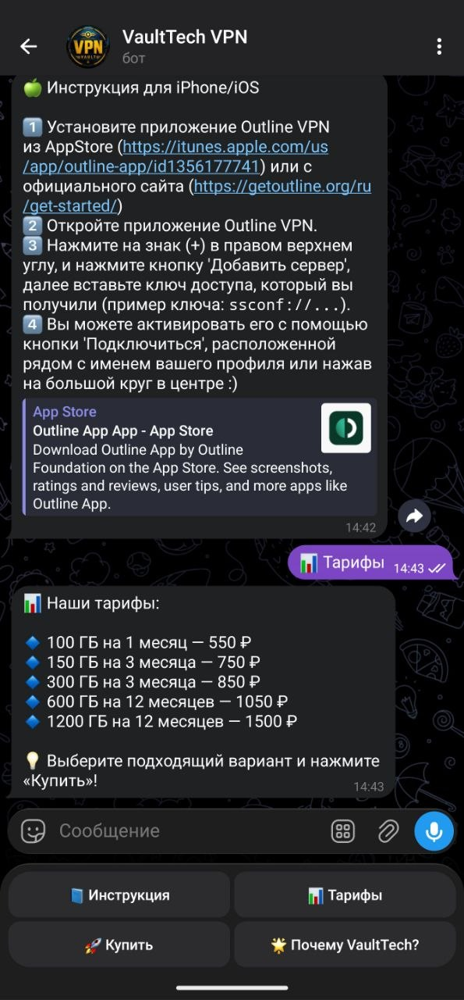

# VaultTech VPN Бот


Полностью автоматизированный Telegram‑бот для продажи ключей Outline VPN с **криптовалютной оплатой** через NowPayments.  
После успешной оплаты пользователь мгновенно получает ключ — без участия оператора.

## Возможности
- 📘 **Пошаговые инструкции** для Android, iOS, Windows, macOS.
- 📊 **Несколько тарифных планов** (от 100 ГБ до 1200 ГБ).
- 💳 **Криптоплатежи** (NowPayments) – автоматическое создание инвойсов и вебхук-подтверждение.
- 🔑 **Автоматическая выдача ключей** из SQLite (выбор случайного неиспользованного).
- 📩 **Уведомления оператора** о каждой покупке.
- 🚀 **Полностью автоматизированный процесс** – пользователь получает ключ сразу после оплаты.

## Скриншоты

| Welcome Menu                        | Instruction                             | Payment | Tariffs                         |
|-------------------------------------|-----------------------------------------|---------|---------------------------------|
|  |  |  |  |

## Технологии
- Python 3.10+
- aiogram 3.x
- aiohttp (вебхук-сервер)
- NowPayments API
- SQLite (хранение ключей)

## Установка

1. Клонируйте репозиторий:
   ```bash
   git clone https://github.com/VoltaStrasse/vpn-telegram-bot.git
   cd vpn-telegram-bot
Создайте виртуальное окружение:

bash
python3 -m venv venv
source venv/bin/activate  # или `venv\Scripts\activate` на Windows
Установите зависимости:

bash
pip install -r requirements.txt
Создайте файл .env из .env.example и заполните:

VPN_BOT_TOKEN – токен бота от @BotFather.

VPN_OPERATOR_ID – ваш Telegram ID (для уведомлений).

NOWPAYMENTS_API_KEY – ключ API NowPayments.

WEBHOOK_URL – публичный URL для вебхуков (например, https://ваш-домен:8443/webhook).

Настройте nginx для проксирования HTTPS-запросов с порта 8443 на 127.0.0.1:8081:

Скопируйте nginx.conf.example в /etc/nginx/sites-available/vpnbot и измените домен и пути к сертификатам.

Включите сайт: sudo ln -s /etc/nginx/sites-available/vpnbot /etc/nginx/sites-enabled/

Проверьте конфиг: sudo nginx -t

Перезагрузите nginx: sudo systemctl reload nginx

Откройте порт 8443 в фаерволе.

Запустите бота:

bash
python bot.py
Конфигурация
VPN_BOT_TOKEN – токен бота.

VPN_OPERATOR_ID – Telegram ID для уведомлений.

NOWPAYMENTS_API_KEY – ключ NowPayments.

WEBHOOK_HOST / WEBHOOK_PORT – внутренний адрес вебхук-сервера (по умолчанию 127.0.0.1:8081).

WEBHOOK_URL – внешний URL для вебхуков NowPayments.

Демо
Протестируйте бота вживую: @VaultTechVPNbot

Лицензия
MIT © 2026 Valentin Voltecc

Контакты
Email: volttecc@gmail.com

Telegram: @volttecc

GitHub: VoltaStrasse

Actual bot: https://t.me/VaultTechVPNbot